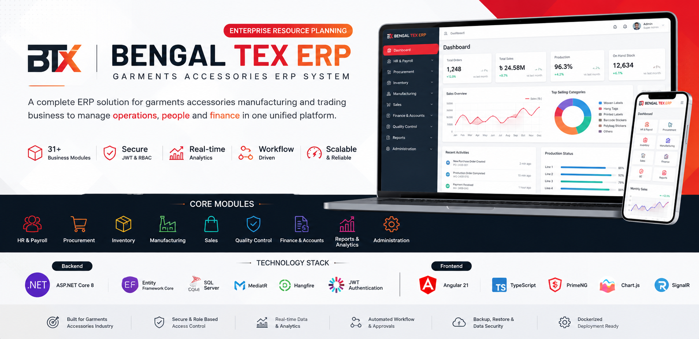

# Bengal TEX ERP

<p align="center">
  
</p>

<p align="center">
  <strong>Enterprise Resource Planning platform for garments‑accessories manufacturing and trading operations.</strong>
</p>

<p align="center">
  
  
  
  
  
  
</p>

---

## 📖 Overview

**Bengal TEX ERP** is a full‑stack enterprise ERP system built for the operational realities of a **garments accessories (zipper, button, thread, label) manufacturing and trading business** based in Bangladesh.

It unifies **HR & Payroll, Procurement, Production, Inventory, Sales, Accounting & Finance, Banking, Quality Control, Compliance, Reporting, Approvals, and Administration** into a single, permission‑governed platform, so that every transaction — from a purchase requisition to a posted journal entry — stays connected and auditable.

The system is implemented as a **layered ASP.NET Core 8 Web API + Angular 21 + SQL Server 2022** application: five backend projects (Domain, Application, Infrastructure, Shared, API) sit behind ~80 REST controllers and a real‑time SignalR hub, while a modular Angular front end (70+ feature modules) consumes them through a typed, PrimeNG‑based UI. The whole stack ships as three Docker containers behind a single `docker-compose.yml`.

> **Project focus:** connect people, products, materials, transactions, production, finance, and approvals through consistent, traceable business workflows — not isolated CRUD screens.

---

## 🗂️ Business Scope

### 👥 HR & Payroll
- Employee management and employee profiles
- Departments, designations, shifts, holidays and leave types
- Attendance and attendance‑correction workflow, multiple office locations
- Employee self‑service login and designation‑driven access
- Payroll, payslips, employee loans, festival bonuses and final settlement

### 🛒 Procurement
- Purchase requisitions → Supplier quotations / RFQ → Purchase orders
- Goods receipt notes, supplier invoices, supplier returns
- Landed cost allocation and purchase payments

### 🏭 Production
- Bill of Materials (BOM) and Material Requirements Planning (MRP)
- Production orders, job cards, work centers, production calendar
- Machine and maintenance management, subcontract orders
- Wastage tracking and scrap sales, production costing

### 📦 Inventory
- Products, product categories and product variants
- Raw materials and raw‑material substitutes
- Warehouses, stock on hand, stock movements and stock lots/batches
- Stock adjustments, stock transfers, opening stock, gate passes

### 💼 Sales
- Quotations → Proforma invoices → Sales orders → Delivery notes → Customer invoices → Receipts
- Customer pricing, customer returns, credit and debit notes

### 💰 Accounting & Finance
- Chart of accounts, journal entries, general ledger / inventory GL
- Budgets, cost centers, costing rates, financial years, exchange rates
- Financial intelligence dashboards, payments and receipts, expenses
- Fixed assets, bank accounts, bank facilities and bank reconciliation
- VAT / statutory workflows, VAT challans, Letters of Credit (LC)
- Export incentives and financial reporting

### 🛡️ Quality, Compliance & Governance
- QC inspections and quarantine disposition
- Compliance records and multi‑step approval workflows
- Full audit logging, granular role and permission management
- Real‑time notifications, attachments and document handling

---

## ⭐ Key Capabilities

| Capability | Implementation |
|---|---|
| Authentication | ASP.NET Core Identity + JWT Bearer, device‑fingerprint‑aware sessions |
| Authorization | Dynamic, policy‑based **permission** system (`HasPermissionAttribute` + custom `PermissionAuthorizationHandler`) |
| Architecture | Layered / Clean Architecture — Domain, Application, Infrastructure, Shared, API |
| Application layer | ~90 feature modules organized as Commands / Queries / DTOs (CQRS‑style) |
| Data access | Entity Framework Core 8, code‑first migrations |
| Database | Microsoft SQL Server 2022 (Express by default, Standard‑ready) |
| Validation | FluentValidation, pipeline‑level via MediatR behaviors |
| Mediator pattern | MediatR 12 |
| Object mapping | Mapster |
| Real‑time communication | ASP.NET Core SignalR (`/hubs/session`) for session & notification events |
| Background jobs | Hangfire (SQL Server storage) — audit‑log retention, DB backups, operational alerts |
| Document generation | QuestPDF (statements, exports), QRCoder (QR generation) |
| Location intelligence | Nominatim reverse geocoding, IP‑based network intelligence, geofencing |
| Security hardening | Global exception middleware, custom security‑headers middleware, fixed‑window rate limiting, suspicious‑activity detection |
| Logging | Serilog (console + rolling file, environment/process/thread enrichment) |
| API documentation | Swagger / OpenAPI (Swashbuckle) |
| API versioning | Asp.Versioning (Mvc + ApiExplorer) |
| Dashboard & charts | Angular + PrimeNG + Chart.js |
| QR / scanning | html5‑qrcode |
| Device fingerprinting | FingerprintJS (client) + `DeviceFingerprintService` (server) |
| Deployment | Docker Compose — SQL Server, API and Angular/nginx as three services |
| Testing | Dedicated Domain, Application and API test projects (xUnit, Moq, FluentAssertions) |

---

## 🏛️ Architecture

```
┌──────────────────────────────────────────────────────────────┐
│                    ANGULAR 21 FRONTEND                       │
│  PrimeNG • TypeScript • RxJS • Chart.js • SignalR • QR       │
└──────────────────────────────┬───────────────────────────────┘
                                │ HTTPS / REST / SignalR
                                ▼
┌──────────────────────────────────────────────────────────────┐
│                 ASP.NET CORE 8 WEB API                       │
│  Controllers • JWT Auth • Permission Policies • Middleware   │
│  Rate Limiting • Security Headers • Global Exception Handler │
└──────────────────────────────┬───────────────────────────────┘
                                ▼
┌──────────────────────────────────────────────────────────────┐
│                    APPLICATION LAYER                         │
│ Commands • Queries • DTOs • FluentValidation • MediatR       │
│ Feature‑oriented modules (Sales, Procurement, HR, Finance…)  │
└──────────────────────────────┬───────────────────────────────┘
                                ▼
┌──────────────────────────────────────────────────────────────┐
│                      DOMAIN LAYER                             │
│ ~90 Entities • Value Objects • Repository Contracts • Rules  │
└──────────────────────────────┬───────────────────────────────┘
                                ▼
┌──────────────────────────────────────────────────────────────┐
│                  INFRASTRUCTURE LAYER                        │
│ EF Core • Identity • Hangfire • Serilog • Email/SMS • PDF/QR │
│ Numbering • Approval • Journal Posting • Stock • Geo/IP      │
└──────────────────────────────┬───────────────────────────────┘
                                ▼
                     ┌────────────────────┐
                     │   SQL Server 2022  │
                     │  (App + Hangfire)  │
                     └────────────────────┘
```

---

## 🧩 Application Modules

The backend `Application` layer is organized into feature modules, each following a Commands / Queries / DTOs structure and exposed through a matching API controller:

Accounting · Approvals · Attachments · Attendance · AuditLog · Auth · BankReconciliation · Banking · Bom · Company · Compliance · CreditNotes · Currency · Customer · CustomerInvoice · CustomerPricing · CustomerReturnNote · Dashboard · DebitNotes · DeliveryNote · Emails · Employee · Expenses · Factory · FixedAssets · GatePasses · GoodsReceipt · Inventory · JobCards · LandedCost · Leaves · MachineMaintenance · MasterSetup · Mrp · Notifications · OpeningStock · Payment · Payroll · Permission · Product · ProductCategory · ProductVariants · Production · ProformaInvoices · PurchaseOrder · PurchaseRequisitions · QcInspection · QuarantineDisposition · Quotations · RawMaterial · RawMaterialSubstitutes · Receipt · Reports · Role · SalesOrder · Samples · ScrapSales · StockLots · StockTransfer · Style · Subcontract · Supplier · SupplierInvoice · SupplierQuotations · SupplierReturnNote · UnitOfMeasure · User · VatChallan · Warehouse · Wastage · WorkCenters

The Angular client mirrors this with **70+ lazy‑loaded feature modules** (`client/src/app/modules/*`), covering everything from `dashboard` and `shop-floor` to `bank-reconciliation` and `production-calendar`.

📌 The exact implementation is organized under the solution's **Domain**, **Application**, **Infrastructure**, **Shared**, and **API** projects.

---

## 🔄 Core Business Workflows

### Procurement to Payment
```
Purchase Requisition
        ↓
Supplier Quotation / RFQ
        ↓
Purchase Order
        ↓
Goods Receipt
        ↓
Supplier Invoice
        ↓
Payment
```

### Sales to Cash
```
Quotation
    ↓
Proforma Invoice (when applicable)
    ↓
Sales Order
    ↓
Delivery Note
    ↓
Customer Invoice
    ↓
Receipt
```

### Production
```
Sales / Production Requirement
            ↓
          BOM
            ↓
          MRP
            ↓
   Production Order
            ↓
        Job Card
            ↓
       Production
            ↓
     QC / Inspection
            ↓
      Finished Goods
```

### Inventory
```
Opening Stock
     │
     ├── Purchase → Goods Receipt
     │
     ├── Production → Finished Goods
     │
     ├── Stock Transfer
     │
     └── Stock Adjustment
              ↓
        Stock Movements
              ↓
        Stock On Hand
```

### HR & Attendance
```
Employee
   ↓
Designation / Role
   ↓
Office Location / Shift
   ↓
Attendance
   ↓
Correction / Supervisor Review
   ↓
Payroll
```

Each of these flows carries a **Draft → Posted / Confirmed → Issued** style document lifecycle, backed by the approval and numbering services described below.

---

## 🔐 Security & Access Control

- **JWT‑based authentication** (`Microsoft.AspNetCore.Authentication.JwtBearer`) with a dedicated `IJwtService` / `JwtService`
- **ASP.NET Core Identity** integration for user and credential management
- **Dynamic permission system** — `HasPermissionAttribute`, `PermissionAuthorizationHandler` and `PermissionPolicyProvider` evaluate fine‑grained permissions per endpoint, on top of role management
- **Device fingerprinting** (`DeviceFingerprintService`, FingerprintJS on the client) and **session enforcement** (`SessionEnforcementService`) to detect and manage concurrent/duplicate sessions
- **Geofencing & location intelligence** — `GeoFenceService`, `NominatimReverseGeocodeService`, `IpApiNetworkIntelligenceService` for location‑aware checks (e.g. attendance)
- **Suspicious‑activity detection** (`SuspiciousActivityDetector`) surfaced through operational alert jobs
- **Global exception middleware** and a **security‑headers middleware** applied to every response
- **Fixed‑window rate limiting** on the API
- **Full audit logging** with a queryable audit trail and a configurable retention job
- **Configurable CORS**, environment‑based secrets and BCrypt‑backed password hashing

⚠️ Sensitive values — database passwords, the JWT signing secret, the device‑fingerprint salt, SMTP credentials, and seed/admin credentials — are supplied exclusively through environment configuration (`.env` / environment variables) and must **never** be committed to source control.

---

## ⚡ Real‑Time & Background Processing

### SignalR
A `SessionHub` (mapped at `/hubs/session`) drives real‑time application communication — session state and notification‑oriented events — pushed to connected Angular clients via `SessionBroadcaster` and `NotificationBroadcaster`.

```
ERP Event
   ↓
ASP.NET Core Hub (SessionHub)
   ↓
Connected Angular Clients
   ↓
Real‑time UI Update
```

### Hangfire
Background processing runs on Hangfire with SQL Server storage (dashboard at `/hangfire`), driving scheduled jobs such as:

- `AuditLogRetentionJob` — audit‑log retention/cleanup
- `DatabaseBackupJob` — scheduled database backups
- `OperationalAlertsJob` — operational/suspicious‑activity alerts
- `OutboxProcessor` — reliable outbox message/event processing
- `NotificationDispatcherHostedService` — dispatches queued notifications

---

## 📊 Reporting & Documents

- Operational, inventory, sales, purchase, HR/attendance and financial reports
- VAT / statutory reporting and VAT challans
- PDF document generation via **QuestPDF** (`ExportPdfRenderer`, `StatementPdfRenderer`)
- QR code generation via **QRCoder** (`QrCodeService`) and scanning via **html5‑qrcode** on the client
- Centralized **attachment** handling (`AttachmentService`) with local file storage
- Email delivery and **email audit/logging** (`SmtpEmailSender`, `DevEmailSender`, `DocumentEmailService`)

---

## 🛠️ Technology Stack

### Backend
- C# / .NET 8, ASP.NET Core Web API
- Entity Framework Core 8 (SQL Server provider + NetTopologySuite for spatial data)
- ASP.NET Core Identity, JWT Bearer Authentication, BCrypt.Net
- MediatR 12, FluentValidation, Mapster
- Hangfire (AspNetCore + SqlServer)
- Serilog (Console + File sinks, environment/process/thread enrichers)
- Swashbuckle (Swagger/OpenAPI), Asp.Versioning (API versioning)
- SignalR, QuestPDF, QRCoder

### Frontend
- Angular 21, TypeScript, RxJS
- PrimeNG + PrimeIcons (`@primeuix/themes`, `@primeuix/styled`)
- Chart.js, html5‑qrcode, @microsoft/signalr, @fingerprintjs/fingerprintjs

### Database
- Microsoft SQL Server 2022 (Express by default — 10 GB cap; switch to Standard when needed)
- EF Core code‑first migrations
- Hangfire SQL Server storage (shares the app database, own `[HangFire]` schema)

### DevOps
- Docker, Docker Compose (3 services: `db`, `api`, `web`)
- nginx (serves the built Angular app and proxies to the API container)
- Named, persistent Docker volumes for SQL data, API uploads, API logs and database backups
- Environment‑based configuration via `.env`

### Testing
- xUnit, Moq, FluentAssertions, coverlet — split across `BengalTex.ERP.Domain.Tests`, `BengalTex.ERP.Application.Tests` and `BengalTex.ERP.Api.Tests`

---

## 📁 Project Structure

```
BengalTex.ERP/
│
├── client/                              # Angular 21 application
│   └── src/app/
│       ├── modules/                     # 70+ lazy-loaded feature modules
│       ├── guards/  interceptors/       # Route guards & HTTP interceptors
│       ├── layout/  shared/             # Shell layout & shared components
│       ├── models/  services/           # Typed models & API service layer
│
├── src/
│   ├── BengalTex.ERP.Domain/            # Entities (~90), value objects, domain rules
│   ├── BengalTex.ERP.Application/       # Commands, queries, DTOs, validators (per-module)
│   ├── BengalTex.ERP.Infrastructure/    # EF Core, Identity, Hangfire jobs, domain services
│   ├── BengalTex.ERP.Shared/            # Shared contracts/utilities
│   └── BengalTex.ERP.Api/               # Controllers, auth, middleware, SignalR hubs
│
├── tests/
│   ├── BengalTex.ERP.Domain.Tests/
│   ├── BengalTex.ERP.Application.Tests/
│   └── BengalTex.ERP.Api.Tests/
│
├── docs/
│   ├── DEPLOYMENT.md
│   ├── UAT-TESTING-GUIDE.md
│   └── UAT-DATA-EXACT-FIELDS.md
│
├── docker-compose.yml
├── DEPLOYMENT.md
├── Directory.Build.props
├── Directory.Packages.props             # Centrally managed NuGet package versions
├── global.json                          # Pinned .NET SDK version (8.0.420)
├── .env.example
└── BengalTex.ERP.sln
```

---

## 🚀 Getting Started

### Prerequisites

- .NET 8 SDK (pinned to `8.0.420` via `global.json`)
- Node.js / npm (Angular 21 tooling)
- Angular CLI 21
- SQL Server 2022, or Docker Desktop
- Git

💡 For the containerized setup, Docker and Docker Compose are recommended — it is the primary, supported deployment path.

### Option 1 — Run with Docker Compose

**1. Clone**
```bash
git clone https://github.com/YOUR-USERNAME/BengalTex-ERP.git
cd BengalTex-ERP
```

**2. Create and configure the environment file**
```bash
cp .env.example .env
```
On Windows PowerShell:
```powershell
Copy-Item .env.example .env
```
Then generate real secrets rather than using the placeholders:
```bash
openssl rand -base64 64 | tr -d '\n'   # → JWT_SECRET
openssl rand -base64 32 | tr -d '\n'   # → FINGERPRINT_SALT
```
Set `SA_PASSWORD`, `JWT_SECRET`, `FINGERPRINT_SALT`, `SEED_ADMIN_PASSWORD`, `PUBLIC_ORIGIN`, `ALLOWED_HOSTS` and `WEB_PORT` in `.env` before first boot.

**3. Start the full stack**
```bash
docker compose up -d --build
```
The compose configuration provisions three services:
```
SQL Server 2022 (db)
        +
ASP.NET Core API (api)
        +
Angular / nginx Web App (web)
```
On first boot, the API waits for the database healthcheck, applies **all EF Core migrations**, and runs an idempotent seeder (roles, permissions, company/factory/warehouse, base currency, units of measure, numbering series, chart of accounts, leave types, and the SuperAdmin account).

**4. Check running containers**
```bash
docker compose ps
```

**5. View logs**
```bash
docker compose logs -f api
```
or:
```bash
docker compose logs -f web
```

**6. Open the app**

By default the web UI is published at `http://localhost:8088` (configurable via `WEB_PORT`).

**7. Stop**
```bash
docker compose down
```

📌 For production deployment — server sizing, secret rotation, TLS termination and backup/restore — follow the full runbook in `DEPLOYMENT.md`, not development/default secrets.

### Option 2 — Run Backend & Frontend Separately

**Backend**

From the repository root:
```bash
dotnet restore
dotnet build
dotnet run --project src/BengalTex.ERP.Api
```
- The API configuration and launch settings determine the local HTTP/HTTPS ports.
- Swagger/OpenAPI is available when enabled by the application environment.
- The Hangfire dashboard is available at `/hangfire` when the API is running.

**Frontend**
```bash
cd client
npm install
npm start
```
Angular development server:
```
http://localhost:4200
```
Build for production:
```bash
npm run build
```

---

## 🧪 Testing

The repository contains dedicated **Domain**, **Application** and **API** test projects (xUnit, Moq, FluentAssertions).

Run the full backend test suite with:
```bash
dotnet test
```

Angular unit tests can be executed with:
```bash
cd client
npm test
```

📌 For end‑to‑end functional testing, use the project's documented UAT guide (see below).

---

## 📋 UAT & Demo Data

The repository includes dedicated documentation for functional testing:

- `docs/UAT-TESTING-GUIDE.md` — a phase‑by‑phase manual UAT script (Login & Company → Master Data → Users & Roles → Employees → Attendance → Leaves & Payroll → Procurement → Production → Inventory → QC → Sales → Returns → Accounting/VAT/Banking/LC → Reports → Approvals/Notifications/Compliance), built around a garments‑accessories factory scenario (zipper, button, thread, label) in BDT / Dhaka.
- `docs/UAT-DATA-EXACT-FIELDS.md` — exact demo field values to paste in while testing, so results are reproducible.
- `docs/DEPLOYMENT.md` / `DEPLOYMENT.md` — the production deployment runbook.

The UAT guide enforces a strict **dependency order** — master data first, then transactions — and every document follows a **Draft → Post / Confirm / Issue** lifecycle that should be exercised during testing.

✨ This makes the repository useful not only as source code, but also as a structured demonstration and testing environment.

---

## 💾 Database & Backup

The Docker Compose environment runs **SQL Server 2022 Express** (10 GB data cap; upgrade `MSSQL_PID` to `Standard` when outgrown) with persistent Docker volumes for data, API uploads, API logs and database backups.

The deployment configuration also supports:

- Database initialization through EF Core migrations on first boot (`Database__InitializeOnStartup`)
- An idempotent data seeder (roles, permissions, company/factory/warehouse, currency, numbering, chart of accounts, SuperAdmin)
- Scheduled database backups via a Hangfire job, with a shared volume for backup/retention cleanup

### Before production use

- Set strong secrets for `SA_PASSWORD`, `JWT_SECRET`, `FINGERPRINT_SALT` and `SEED_ADMIN_PASSWORD` — never reuse defaults or any secret that has ever been committed to git history.
- Change any initial/default administrative credentials after first login.
- Set `PUBLIC_ORIGIN` and `ALLOWED_HOSTS` to the exact hostnames users will browse to.
- Configure SMTP if email delivery is required (`SmtpEmailSender`).
- Test database backup and restore end‑to‑end before go‑live.
- Enable TLS/HTTPS (e.g. via a reverse proxy) when exposed beyond a trusted internal network.
- Review the complete checklist in `DEPLOYMENT.md`.

---

## ⚙️ Configuration

Copy the example environment file:
```bash
cp .env.example .env
```

Key configuration values (see `.env.example` for the full list):

| Variable | Purpose |
|---|---|
| `SA_PASSWORD` | SQL Server `sa` password |
| `JWT_SECRET` | JWT signing key (≥ 32 bytes) |
| `FINGERPRINT_SALT` | Salt used by the device‑fingerprint service |
| `PUBLIC_ORIGIN` | Public browser origin, used for CORS |
| `ALLOWED_HOSTS` | Allowed `Host` header value(s) |
| `SEED_ADMIN_PASSWORD` | First‑boot SuperAdmin password (used only if the account doesn't exist yet) |
| `WEB_PORT` | Port the web UI is published on (default `8088`) |

⚠️ Never commit real secrets, passwords, tokens, or production connection strings.

---

## 💡 Why Bengal TEX ERP?

Bengal TEX ERP is designed around **connected business processes**, not isolated CRUD screens. The platform links:

**People → Procurement → Inventory → Production → Quality → Sales → Accounting**

so that transactions move through controlled, permissioned workflows while operational and financial data stay traceable end‑to‑end — from a raw‑material purchase requisition all the way to a posted customer receipt.

---

## 🏆 Engineering Highlights

- ~90 feature modules across the Application layer, each with Commands, Queries, DTOs and validators
- Layered/Clean Architecture separating Domain, Application, Infrastructure and API concerns
- Dynamic, attribute‑driven permission authorization (`HasPermissionAttribute`) rather than static role checks alone
- CQRS‑style command/query organization through MediatR, with FluentValidation pipeline behaviors
- Real‑time updates via SignalR, background processing via Hangfire (retention, backups, alerts, outbox, notifications)
- Structured logging with Serilog, global exception handling, security‑headers middleware and rate limiting
- Device fingerprinting, session enforcement and geolocation‑aware services (geofencing, reverse geocoding, IP intelligence)
- PDF and QR document generation (QuestPDF, QRCoder)
- Swagger/OpenAPI documentation with API versioning
- Dedicated Domain, Application and API test projects
- Fully Dockerized deployment with persistent volumes for data, uploads, logs and backups
- Detailed UAT documentation with exact, reproducible demo data

---

## 📌 Project Status

**Active** enterprise application / development project. Features and workflows continue to evolve as business requirements change.

---

## ⚠️ Disclaimer

This repository is intended to demonstrate the architecture, engineering practices, business workflows, and technical capabilities of the Bengal TEX ERP platform.

Production deployment should use organization‑specific configuration, credentials, security policies, backup procedures, and infrastructure — see `DEPLOYMENT.md` for the full runbook.

---

## ✍️ Author

**MD. Enamul Haque**
ASP.NET Core Full‑Stack Developer | Software Engineer | Statistics Graduate

**Core technologies:** `C#` `ASP.NET Core` `Angular` `React` `SQL Server` `Entity Framework Core` `REST API` `JavaScript` `TypeScript` `Node.js` `MongoDB` `.NET MAUI`

---

<p align="center"><strong>Bengal TEX ERP — Connecting Operations, People & Finance in One Platform.</strong></p>
